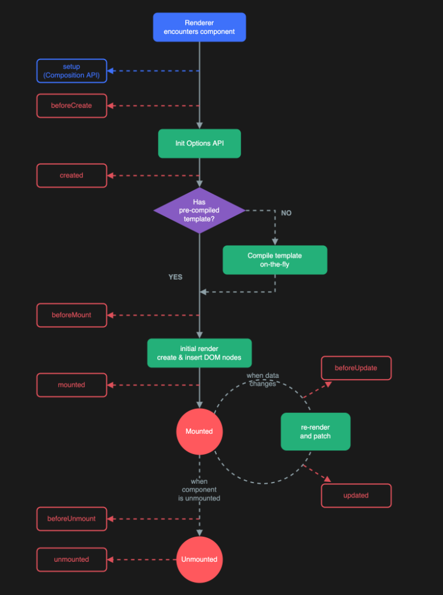

# Vue-3 Note 2
1. 组件基础与使用
   1. 定义一个组件三要素：`template`,`script`,`style`
   2. 使用
      1. `script`下导入组件
      2. 在`components`属性下注册组件
      3. `template`下使用，同html标签
   3. demo code
      * Child.vue
      ```html
      <template>
        <div id="container">
            <h2>this is son component</h2>
        </div>
        </template>

        <script>
        export default {
            name: "Child",
        }
        </script>

        <style scoped>
        #container{
            border: 1px solid black;
            background-color: cyan;
        }
        </style>
      ``` 
      * Content.vue
      ```html
      <template>
        <div id="container">
            <h2>This is the content of a component</h2>
            <Child></Child>
        </div>
        </template>

        <script>
        import Child from "./Child.vue";
        export default {
            name: "Content",
            components:{
                Child
            }
        }
        </script>

        <style scoped>
        #container{
            border: 1px solid black;
            padding: 5px;
        }
        </style>
      ```
2. 组件通信
   1. 父传子: 通过`props`
      * 步骤
        1. 父组件使用（类似于属性)
        2. 子组件接收props
        3. 子组件使用props
      * demo code  
        * Child.vue
        ```html
        <template>
            <div id="container">
                <h2>this is son component</h2>
                <h2>message from father component:{{ message }}</h2>
                <div>{{list}}</div>
            </div>
        </template>

        <script>
        export default {
            name: "Child",
            props: {
                message: {
                type: String,
                default: "hello world"
                },
                list:{
                type:Array,
                default(){
                    return [1,2,3]
                }
                }
            }
        }
        </script>

        <style scoped>
        #container {
            border: 1px solid black;
            background-color: cyan;
        }
        </style>
        ``` 
        * Content.vue 
        ```html
        <template>
            <div id="container">
                <h2>This is the content of a component</h2>
                <Child :message="msg"></Child>
            </div>
        </template>

        <script>
        import Child from "./Child.vue";
            export default {
            name: "Content",
            data(){
                return{
                msg:"hello world",
                list:[1,2,3,4]
                }
            },
            components:{
                Child
            }
        }
        </script>

        <style scoped>
        #container{
            border: 1px solid black;
            padding: 5px;
        }
        </style>
        ``` 
      * props验证
        1. 类型：Number,Boolean,Array,Object,String, e.g. `type: String`
        2. 初始值
           1. `default: xxx`
           2. 对象和数组应该使用工厂模式返回初始值 
        3. 是否是必写属性：`require: true`
      * props注意事项
        4. props是单项数据流，父组件改变导致子组件变化，子组件变化不能导致父组件变化
        5. props应该是只读的 

   2. 子传父: 自定义事件
      * 步骤:
        1. 使用`$emit`自定义事件，并发送数据
        2. 父组件监听自定义事件
        3. 父组件使用事件处理，接收数据 
      * demo code 
        * Child.vue
        ```html
        <template>
          <div id="container">
              <h2>this is son component</h2>
          </div>
          </template>

          <script>
          export default {
              name: "Child",
          }
          </script>

          <style scoped>
          #container{
              border: 1px solid black;
              background-color: cyan;
          }
          </style>
        ``` 
        * Content.vue
        ```html
        <template>
          <div id="container">
              <h2>This is the content of a component</h2>
              <Child></Child>
          </div>
          </template>

          <script>
          import Child from "./Child.vue";
          export default {
              name: "Content",
              components:{
                  Child
              }
          }
          </script>

          <style scoped>
          #container{
              border: 1px solid black;
              padding: 5px;
          }
          </style>
        ```
    3. 父组件访问子组件：`$refs`
       1. ref属性可视为组件的回调钩子id
        ```html
        <Child :message="msg" @send="receive" ref="hello"></Child>
        ```
       2. 获取
       ```js
       this.$refs.hello
       ``` 
    4. 子组件访问父组件：`$parent`
    5. 子组件访问根组件：`$root`
    6. 组件跨级通信：`provide`&`inject`
       * 注意1：如果需要传变量，provide应为函数，返回一个对象 
       * 注意2：`provide`&`inject`不是响应式的
       * demo code: 以第一级组件直接向第三级组件传数据为例
          * 第一级组件
          ```js
          provide(){
            return{
            msg:this.msg
            }
          }
          ``` 
          * 第三级组件   
          ```js
          inject:['msg']
          ``` 
       * 如何解决响应式问题=>用对象包装后传入（应为传递的对象是浅拷贝的，所以可以实现数据响应式更改）
          * 第一级组件
          ```js
            import Father from "./Father.vue";

            export default {
            name: "GrandParent",
            data() {
                return {
                msg: "hello",
                obj:{
                    msg:"hello"
                }
                }
            },
            components: {
                Father
            },
            provide(){
                return{
                msg:this.msg,
                obj:this.obj
                }
            },
            methods:{
                change(){
                this.obj.msg+='_suffix';
                }
            }
            }
          ``` 
          * 第三级组件   
          ```js
          inject:['msg','obj']
          ``` 
        *  解决响应方法之二：provide传入匿名函数包装数据，inject接收后，再用计算属性更新数据（mustache插值不推荐写函数调用） 
           *  第一级组件
           ```js
            provide(){
                return{
                msg:()=>this.msg,
                obj:this.obj
                }
            },
           ```  
           *  第三级组件
           ```js
           export default {
            name: "Son",
            inject:['msg','obj'],
            computed:{
                newMsg(){
                return this.msg();
                }
            }
           }
           ```  
           
3. 插槽
   1. 插槽:通过占位符实现父组件向子组件注入内容，提高子组件复用性
       * 子组件
       ```html
       <template>
        <div id="container">
            <slot></slot>
        </div>
       </template>
       ``` 
       * 父组件
       ```html
       <template>
        <div id="container">
            <Son>
            <button>click me</button>
            </Son>
            <Son>
            <p>click me</p>
            </Son>
        </div>
       </template>
       ``` 
   2. 具名插槽（通过`name`属性匹配多个插槽）
       * 子组件：指定slot标签的`name`
       ```html
       <template>
        <div id="container">
            <slot name="header"></slot>
            <slot name="footer"></slot>
        </div>
       </template>
       ``` 
       * 父组件：使用template标签包裹插槽内容，指定`v-slot:name`
       ```html
       <template>
        <div id="container">
            <Son>
            <template v-slot:header>
                <button>click me</button>
            </template>
            <template v-slot:footer>
                <p>click me</p>
            </template>
            </Son>
        </div>
       </template>
       ```  
    3. 插槽的数据作用域：父组件
    4. 插槽备用内容：插槽的默认值
       * 在slot标签内写默认内容即可
       ```html
       <button>
        <slot name="btn">
            default
        </slot>
       </button>
       ```  
    5. 作用域插槽：使用子组件的数据
       1. 子组件定义`:slotProps=xxx`
       ```html
       <slot name="list" :list="list"></slot>
       ``` 
       2. 父组件通过`slotProps.obj`接收
       ```html
       <template v-slot:list="slotProps">
        <div>{{slotProps}}</div>
        <ul>
          <li v-for="num in slotProps.list">{{num}}</li>
        </ul>
      </template>
       ```
4. 生命周期
   1. vue的生命周期
   2. 生命周期回调函数
    
5. Vue3-组合式api: 合并同一逻辑关注点的代码
   1. 使用`setup`入口函数，替代`beforeCreate`和`created`（组件创建之前被执行，无法使用this对象，在setup中暴露的数据不是响应式的）
   2. 使用`ref函数`定义响应式变量，维护时使用`refObj.value`改变数据，但是注意模板会自动解析`refObj`
   3. 使用`reactive`定义复杂类型
   4. 使用`toRef(obj,attrName)`使对象某一属性获得响应式
   5. 使用`...toRefs(obj)`使对象解构(es6新语法)，并使所有属性获得响应式
      * demo code
      ```html
      <template>
        <div>
            <div>{{counter}}</div>
            <button @click="changeCounter">+1</button>
            <hr>
            <div>{{name}}</div>
            <button @click="changeObjName">change name</button>
        </div>
      </template>

      <script>
        import {reactive, ref, toRefs} from "vue";

        export default {
            setup(){
                // =========== counter ====================
                const counter=ref(0);
                function changeCounter() {
                    counter.value++;
                }
                // =========== obj ====================
                const obj=reactive({
                    name:"openhe",
                });
                function changeObjName(){
                    obj.name='openhe_1';
                }

                return {counter,changeCounter,obj,changeObjName,...toRefs(obj)};
            }
        }
      </script>

      <style scoped>

      </style>
      ```  
   6. setup语法糖：解决setup函数频繁导出数据函数的不方便
        * 使用setup语法糖改写demo code
        ```html
        <template>
            <div>
                <div>{{ counter }}</div>
                <button @click="changeCounter">+1</button>
                <hr>
                <div>{{ obj.name }}</div>
                <button @click="changeObjName">change name</button>
            </div>
        </template>

        <script setup>
            import {reactive, ref} from "vue";

            // =========== counter ====================
            const counter = ref(0);

            function changeCounter() {
                counter.value++;
            }

            // =========== obj ====================
            const obj = reactive({
                name: "openhe",
            });

            function changeObjName() {
                obj.name = 'openhe_1';
            }
        </script>

        <style scoped>

        </style>
        ```   
   7. 组合式api-侦听器
      1. 侦听普通变量（注意此处的第一个参数是语法糖，完整参数应为一个收集监听源的函数）
      ```js
      watch(counter,(newVal,oldVal)=>{
        console.log(`new val=${newVal}`);
        console.log(`old val=${oldVal}`);
      })
      ``` 
      2. 侦听对象中的值
      ```js
      watch(()=>obj.name,(newVal,oldVal)=>{
        console.log(newVal);
        console.log(oldVal);
      })
      ``` 
      3. watchEffect：自动收集所有依赖+immediate\
      ```js
      watchEffect(()=>{
        console.log(obj.name);
      })
      ``` 
   8. 组合式api-计算属性
      ```js
      const reversedUsername=computed(()=>{
        return username.value.split('').reverse().join('');
      })
      ``` 
   9.  组合式api-生命周期回调函数  
       * 变化
         1. beforeCreate和created应该在setup中编写
         2. 函数名变化：xxx=>onXxx
       * demo code
       ```js
       onBeforeMount(()=>{
        console.log("before mounted");
       })
       onMounted(()=>{
        console.log("mounted");
       })
       ``` 
   10. 组合式api-Props（父传子）
       * 变化
         1. 父组件：只需引入子组件，不需要注册
         2. 子组件：使用defineProps添加props验证，并使用`toRefs`解构使用props  
       * demo code
         * 父组件
           ```html
            <template>
                <div>
                    <p>Father Component</p>
                    <Son :msg="msg"></Son>
                </div>
            </template>

            <script setup>
            import Son from './Son.vue'
            import {ref} from "vue";

            // =====msg=====
            const msg=ref('msg from father');
            </script>
           ``` 
         * 子组件
           ```html
            <template>
            <div>
                <p>Son Component</p>
                <div>receive from father: {{msg}}</div>
            </div>
            </template>

            <script setup>
            import {toRefs} from "vue";

            const props=defineProps({
                msg:{
                    type:String,
                    default:"hello"
                }
            });
            const {msg}=toRefs(props)
            </script>
           ```
           * 注意：数组或对象直接通过`props.arr/obj`获取     
   11. 组合式api-子传父
       * 改变
         1. 子组件使用`defineEmits`函数
       * demo code
         * 子组件
          ```html
          <template>
            <div>
                <p>Son Component</p>
                <div>receive from father: {{msg}}</div>
                <button @click="sendFather">send father</button>
            </div>
          </template>

          <script setup>
            import {reactive, toRefs} from "vue";

            // data
            const nums=reactive([1,2,3]);

            // props
            const props=defineProps({
            msg:{
                type:String,
                default:"hello"
            }
            });
            const {msg}=toRefs(props)

            // emit
            const emit=defineEmits(['send']);
            const sendFather=()=>{
            emit('send',nums);
            }
          </script>
          ```  
         * 父组件 (注意传递数组不能直接赋值，会失去响应性)
          ```html
          <template>
            <div>
                <p>Father Component</p>
                <Son :msg="msg" @send="receive"></Son>
                <div>receive: {{nums}}</div>
            </div>
          </template>

          <script setup>
            import Son from './Son.vue'
            import {reactive, ref, toRefs} from "vue";

            // =====msg=====
            const msg=ref('msg from father');
            let nums=reactive([]);

            // receive
            const receive=(_nums)=>{
            console.log(`receive:${_nums}`);
            nums.push(..._nums);
            }
          </script>
          ``` 
   12. 组合式api-context
       * 使用setup函数时，接受的第二个参数是context；使用语法糖时，主要功能拆分为四个函数  
         1. `useAttrs`：获取属性
         2. `useSlots`：获取插槽 
         3. `defineEmits`：发起emit事件
         4. `defineExpose`：暴露组件数据（默认都不暴露）
            * 子组件
            ```js
            defineExpose({nums});
            ``` 
            * 父组件 
            ```js
            const sonRef=ref();
            onMounted(()=>{
                console.log(sonRef.value.nums);
            })
            ``` 
   13. 组合式api-`provide` & `inject`
       1.  provide
       ```js
       provide('eventName',data);
       ```  
       3.  inject
       ```js
       const data=inject('eventName');
       ```  
       

      